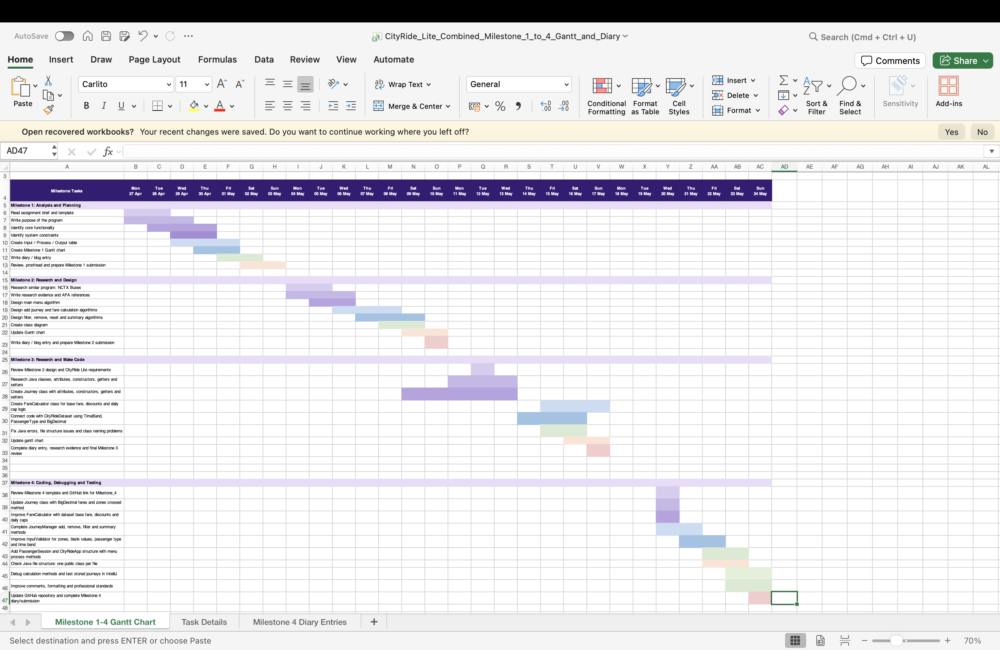

# IY4113 Milestone 4

| Assessment Details | Please Complete All Details     |
| ------------------ |---------------------------------|
| Group              | B                               |
| Module Title       | Applied Software Engineering    |
| Assessment Type    | ASSESSMENT 1: Java Fundamentals |
| Module Tutor Name  | Jonathan shore                  |
| Student ID Number  | P505853                         |
| Date of Submission | 24 May 2026                     |
| Word Count         |                                 |
| GItHub Link        |https://github.com/T0505853Maeko/Milestone_4                                 |

- [ ] *I confirm that this assignment is my own work. Where I have referred to academic sources, I have provided in-text citations and included the sources in
  the final reference list.*

- [ ] *Where I have used AI, I have cited and referenced appropriately.

------------------------------------------------------------------------------------------------------------------------------

### Program Code

---

Paste the current program code created so far. It does not have to be runnable code (document though if it does not work!)

------------------------------------------------------------------------------------------------------------------------------

*Program code goes here:*
```java
// This class stores one public transport journey for CityRide Lite.
import java.math.BigDecimal;


public class Journey {

    // Attributes
    private int journeyId;
    private String journeyDate;
    private int fromZone;
    private int toZone;
    private CityRideDataset.TimeBand timeBand;
    private CityRideDataset.PassengerType passengerType;
    private int zonesCrossed;
    private BigDecimal baseFare;
    private BigDecimal discountAmount;
    private BigDecimal discountedFare;
    private BigDecimal chargedFare;

    // Constructors
    public Journey() {
        this.journeyId = 0;
        this.journeyDate = "";
        this.fromZone = 1;
        this.toZone = 1;
        this.timeBand = CityRideDataset.TimeBand.OFF_PEAK;
        this.passengerType = CityRideDataset.PassengerType.ADULT;
        this.zonesCrossed = 1;
        this.baseFare = BigDecimal.ZERO;
        this.discountAmount = BigDecimal.ZERO;
        this.discountedFare = BigDecimal.ZERO;
        this.chargedFare = BigDecimal.ZERO;
    }

    public Journey(int journeyId, String journeyDate, int fromZone, int toZone,
                   CityRideDataset.TimeBand timeBand,
                   CityRideDataset.PassengerType passengerType) {
        this.journeyId = journeyId;
        this.journeyDate = journeyDate;
        this.fromZone = fromZone;
        this.toZone = toZone;
        this.timeBand = timeBand;
        this.passengerType = passengerType;
        this.zonesCrossed = calculateZonesCrossed();
        this.baseFare = BigDecimal.ZERO;
        this.discountAmount = BigDecimal.ZERO;
        this.discountedFare = BigDecimal.ZERO;
        this.chargedFare = BigDecimal.ZERO;
    }

    // Getter methods
    public int getJourneyId() {
        return journeyId;
    }

    public String getJourneyDate() {
        return journeyDate;
    }

    public int getFromZone() {
        return fromZone;
    }

    public int getToZone() {
        return toZone;
    }

    public CityRideDataset.TimeBand getTimeBand() {
        return timeBand;
    }

    public CityRideDataset.PassengerType getPassengerType() {
        return passengerType;
    }

    public int getZonesCrossed() {
        return zonesCrossed;
    }

    public BigDecimal getBaseFare() {
        return baseFare;
    }

    public BigDecimal getDiscountAmount() {
        return discountAmount;
    }

    public BigDecimal getDiscountedFare() {
        return discountedFare;
    }

    public BigDecimal getChargedFare() {
        return chargedFare;
    }

    // Setter methods
    public void setJourneyId(int journeyId) {
        this.journeyId = journeyId;
    }

    public void setJourneyDate(String journeyDate) {
        this.journeyDate = journeyDate;
    }

    public void setFromZone(int fromZone) {
        this.fromZone = fromZone;
        this.zonesCrossed = calculateZonesCrossed();
    }

    public void setToZone(int toZone) {
        this.toZone = toZone;
        this.zonesCrossed = calculateZonesCrossed();
    }

    public void setTimeBand(CityRideDataset.TimeBand timeBand) {
        this.timeBand = timeBand;
    }

    public void setPassengerType(CityRideDataset.PassengerType passengerType) {
        this.passengerType = passengerType;
    }

    public void setBaseFare(BigDecimal baseFare) {
        this.baseFare = baseFare;
    }

    public void setDiscountAmount(BigDecimal discountAmount) {
        this.discountAmount = discountAmount;
    }

    public void setDiscountedFare(BigDecimal discountedFare) {
        this.discountedFare = discountedFare;
    }

    public void setChargedFare(BigDecimal chargedFare) {
        this.chargedFare = chargedFare;
    }

    // Calculation methods
    public int calculateZonesCrossed() {
        return Math.abs(toZone - fromZone) + 1;
    }
}
```

Fare Calculator

```java
// This class calculates fares, discounts, and daily cap charges.
import java.math.BigDecimal;
import java.math.RoundingMode;
// This class calculates fares, discounts, and daily cap charges.
public class FareCalculator {

    // Attributes
    private BigDecimal adultRunningTotal;
    private BigDecimal studentRunningTotal;
    private BigDecimal childRunningTotal;
    private BigDecimal seniorRunningTotal;

    // Constructors
    public FareCalculator() {
        this.adultRunningTotal = BigDecimal.ZERO;
        this.studentRunningTotal = BigDecimal.ZERO;
        this.childRunningTotal = BigDecimal.ZERO;
        this.seniorRunningTotal = BigDecimal.ZERO;
    }

    // Getter methods
    public BigDecimal getAdultRunningTotal() {
        return adultRunningTotal;
    }

    public BigDecimal getStudentRunningTotal() {
        return studentRunningTotal;
    }

    public BigDecimal getChildRunningTotal() {
        return childRunningTotal;
    }

    public BigDecimal getSeniorRunningTotal() {
        return seniorRunningTotal;
    }

    // Setter methods
    public void setAdultRunningTotal(BigDecimal adultRunningTotal) {
        this.adultRunningTotal = adultRunningTotal;
    }

    public void setStudentRunningTotal(BigDecimal studentRunningTotal) {
        this.studentRunningTotal = studentRunningTotal;
    }

    public void setChildRunningTotal(BigDecimal childRunningTotal) {
        this.childRunningTotal = childRunningTotal;
    }

    public void setSeniorRunningTotal(BigDecimal seniorRunningTotal) {
        this.seniorRunningTotal = seniorRunningTotal;
    }

    // Fare methods
    public BigDecimal calculateBaseFare(int fromZone, int toZone, CityRideDataset.TimeBand timeBand) {
        BigDecimal baseFare = CityRideDataset.getBaseFare(fromZone, toZone, timeBand);

        if (baseFare == null) {
            return BigDecimal.ZERO.setScale(2, RoundingMode.HALF_UP);
        }

        return roundToTwoDecimals(baseFare);
    }

    public BigDecimal getDiscountRate(CityRideDataset.PassengerType passengerType) {
        BigDecimal discountRate = CityRideDataset.DISCOUNT_RATE.get(passengerType);

        if (discountRate == null) {
            return BigDecimal.ZERO;
        }

        return discountRate;
    }

    public BigDecimal getDailyCap(CityRideDataset.PassengerType passengerType) {
        BigDecimal dailyCap = CityRideDataset.DAILY_CAP.get(passengerType);

        if (dailyCap == null) {
            return BigDecimal.ZERO.setScale(2, RoundingMode.HALF_UP);
        }

        return roundToTwoDecimals(dailyCap);
    }

    public BigDecimal getRunningTotal(CityRideDataset.PassengerType passengerType) {
        if (passengerType == CityRideDataset.PassengerType.STUDENT) {
            return studentRunningTotal;
        } else if (passengerType == CityRideDataset.PassengerType.CHILD) {
            return childRunningTotal;
        } else if (passengerType == CityRideDataset.PassengerType.SENIOR_CITIZEN) {
            return seniorRunningTotal;
        }

        return adultRunningTotal;
    }

    public void updateRunningTotal(CityRideDataset.PassengerType passengerType, BigDecimal chargedFare) {
        if (passengerType == CityRideDataset.PassengerType.STUDENT) {
            studentRunningTotal = studentRunningTotal.add(chargedFare);
        } else if (passengerType == CityRideDataset.PassengerType.CHILD) {
            childRunningTotal = childRunningTotal.add(chargedFare);
        } else if (passengerType == CityRideDataset.PassengerType.SENIOR_CITIZEN) {
            seniorRunningTotal = seniorRunningTotal.add(chargedFare);
        } else {
            adultRunningTotal = adultRunningTotal.add(chargedFare);
        }
    }

    public void applyFareToJourney(Journey journey) {
        BigDecimal baseFare = calculateBaseFare(
                journey.getFromZone(),
                journey.getToZone(),
                journey.getTimeBand()
        );

        BigDecimal discountRate = getDiscountRate(journey.getPassengerType());
        BigDecimal discountAmount = baseFare.multiply(discountRate);
        BigDecimal discountedFare = baseFare.subtract(discountAmount);
        BigDecimal chargedFare = applyDailyCap(journey.getPassengerType(), discountedFare);

        journey.setBaseFare(roundToTwoDecimals(baseFare));
        journey.setDiscountAmount(roundToTwoDecimals(discountAmount));
        journey.setDiscountedFare(roundToTwoDecimals(discountedFare));
        journey.setChargedFare(roundToTwoDecimals(chargedFare));

        updateRunningTotal(journey.getPassengerType(), roundToTwoDecimals(chargedFare));
    }

    public BigDecimal applyDailyCap(CityRideDataset.PassengerType passengerType, BigDecimal discountedFare) {
        BigDecimal runningTotal = getRunningTotal(passengerType);
        BigDecimal dailyCap = getDailyCap(passengerType);

        if (runningTotal.compareTo(dailyCap) >= 0) {
            return BigDecimal.ZERO.setScale(2, RoundingMode.HALF_UP);
        }

        if (runningTotal.add(discountedFare).compareTo(dailyCap) > 0) {
            return dailyCap.subtract(runningTotal);
        }

        return discountedFare;
    }

    public BigDecimal roundToTwoDecimals(BigDecimal value) {
        return value.setScale(2, RoundingMode.HALF_UP);
    }

    public void resetTotals() {
        adultRunningTotal = BigDecimal.ZERO;
        studentRunningTotal = BigDecimal.ZERO;
        childRunningTotal = BigDecimal.ZERO;
        seniorRunningTotal = BigDecimal.ZERO;
    }
}
```
Manage journey
```java
import java.math.BigDecimal;
import java.util.ArrayList;

// JourneyManager.java
// This class stores, removes, filters, and summarises journeys in memory.

public class JourneyManager {

    // Attributes
    private ArrayList<Journey> journeys;
    private FareCalculator fareCalculator;
    private int nextJourneyId;

    // Constructors
    public JourneyManager() {
        this.journeys = new ArrayList<>();
        this.fareCalculator = new FareCalculator();
        this.nextJourneyId = 1;
    }

    // Getter methods
    public ArrayList<Journey> getJourneys() {
        return journeys;
    }

    public FareCalculator getFareCalculator() {
        return fareCalculator;
    }

    public int getNextJourneyId() {
        return nextJourneyId;
    }

    // Setter methods
    public void setJourneys(ArrayList<Journey> journeys) {
        this.journeys = journeys;
    }

    public void setFareCalculator(FareCalculator fareCalculator) {
        this.fareCalculator = fareCalculator;
    }

    public void setNextJourneyId(int nextJourneyId) {
        this.nextJourneyId = nextJourneyId;
    }

    // Journey management methods
    public Journey addJourney(String journeyDate, int fromZone, int toZone,
                              CityRideDataset.TimeBand timeBand,
                              CityRideDataset.PassengerType passengerType) {

        Journey journey = new Journey(
                nextJourneyId,
                journeyDate,
                fromZone,
                toZone,
                timeBand,
                passengerType);

        fareCalculator.applyFareToJourney(journey);
        journeys.add(journey);
        nextJourneyId++;

        return journey;
    }

    public boolean removeJourneyById(int journeyId) {
        Journey journeyToRemove = findJourneyById(journeyId);

        if (journeyToRemove == null) {
            return false;
        }

        journeys.remove(journeyToRemove);
        recalculateAllFares();

        return true;
    }

    public Journey findJourneyById(int journeyId) {
        for (Journey journey : journeys) {
            if (journey.getJourneyId() == journeyId) {
                return journey;
            }
        }

        return null;
    }

    public ArrayList<Journey> filterByPassengerType(CityRideDataset.PassengerType passengerType) {
        ArrayList<Journey> filteredJourneys = new ArrayList<>();

        for (Journey journey : journeys) {
            if (journey.getPassengerType() == passengerType) {
                filteredJourneys.add(journey);
            }
        }

        return filteredJourneys;
    }

    public ArrayList<Journey> filterByTimeBand(CityRideDataset.TimeBand timeBand) {
        ArrayList<Journey> filteredJourneys = new ArrayList<>();

        for (Journey journey : journeys) {
            if (journey.getTimeBand() == timeBand) {
                filteredJourneys.add(journey);
            }
        }

        return filteredJourneys;
    }

    public ArrayList<Journey> filterByZone(int zone) {
        ArrayList<Journey> filteredJourneys = new ArrayList<>();

        for (Journey journey : journeys) {
            if (journey.getFromZone() == zone || journey.getToZone() == zone) {
                filteredJourneys.add(journey);
            }
        }

        return filteredJourneys;
    }

    public ArrayList<Journey> filterByDate(String journeyDate) {
        ArrayList<Journey> filteredJourneys = new ArrayList<>();

        for (Journey journey : journeys) {
            if (journey.getJourneyDate().equals(journeyDate)) {
                filteredJourneys.add(journey);
            }
        }

        return filteredJourneys;
    }

    // Summary methods
    public int getTotalJourneyCount() {
        return journeys.size();
    }

    public BigDecimal getTotalChargedCost() {
        BigDecimal total = BigDecimal.ZERO;

        for (Journey journey : journeys) {
            total = total.add(journey.getChargedFare());
        }

        return fareCalculator.roundToTwoDecimals(total);
    }

    public BigDecimal getAverageCostPerJourney() {
        if (journeys.isEmpty()) {
            return BigDecimal.ZERO;
        }

        BigDecimal journeyCount = new BigDecimal(journeys.size());

        return fareCalculator.roundToTwoDecimals(
                getTotalChargedCost().divide(journeyCount, 2, BigDecimal.ROUND_HALF_UP));
    }

    public Journey getMostExpensiveJourney() {
        if (journeys.isEmpty()) {
            return null;
        }

        Journey mostExpensiveJourney = journeys.get(0);

        for (Journey journey : journeys) {
            if (journey.getChargedFare().compareTo(mostExpensiveJourney.getChargedFare()) > 0) {
                mostExpensiveJourney = journey;
            }
        }

        return mostExpensiveJourney;
    }

    public int countPeakJourneys() {
        int count = 0;

        for (Journey journey : journeys) {
            if (journey.getTimeBand() == CityRideDataset.TimeBand.PEAK) {
                count++;
            }
        }

        return count;
    }

    public int countOffPeakJourneys() {
        int count = 0;

        for (Journey journey : journeys) {
            if (journey.getTimeBand() == CityRideDataset.TimeBand.OFF_PEAK) {
                count++;
            }
        }

        return count;
    }

    public int countJourneysByPassengerType(CityRideDataset.PassengerType passengerType) {
        int count = 0;

        for (Journey journey : journeys) {
            if (journey.getPassengerType() == passengerType) {
                count++;
            }
        }

        return count;
    }

    public BigDecimal getPreDiscountTotalByPassengerType(CityRideDataset.PassengerType passengerType) {
        BigDecimal total = BigDecimal.ZERO;

        for (Journey journey : journeys) {
            if (journey.getPassengerType() == passengerType) {
                total = total.add(journey.getBaseFare());
            }
        }

        return fareCalculator.roundToTwoDecimals(total);
    }

    public BigDecimal getDiscountedTotalByPassengerType(CityRideDataset.PassengerType passengerType) {
        BigDecimal total = BigDecimal.ZERO;

        for (Journey journey : journeys) {
            if (journey.getPassengerType() == passengerType) {
                total = total.add(journey.getDiscountedFare());
            }
        }

        return fareCalculator.roundToTwoDecimals(total);
    }

    public BigDecimal getChargedTotalByPassengerType(CityRideDataset.PassengerType passengerType) {
        BigDecimal total = BigDecimal.ZERO;

        for (Journey journey : journeys) {
            if (journey.getPassengerType() == passengerType) {
                total = total.add(journey.getChargedFare());
            }
        }

        return fareCalculator.roundToTwoDecimals(total);
    }

    public boolean hasReachedCap(CityRideDataset.PassengerType passengerType) {
        BigDecimal chargedTotal = getChargedTotalByPassengerType(passengerType);
        BigDecimal dailyCap = fareCalculator.getDailyCap(passengerType);

        return chargedTotal.compareTo(dailyCap) >= 0;
    }

    public void resetDay() {
        journeys.clear();
        fareCalculator.resetTotals();
        nextJourneyId = 1;
    }

    public void recalculateAllFares() {
        fareCalculator.resetTotals();

        for (Journey journey : journeys) {
            fareCalculator.applyFareToJourney(journey);
        }
    }
}
```
Validator input
```java
public class InputValidator {

    // Attributes
    private static final int MIN_ZONE = CityRideDataset.MIN_ZONE;
    private static final int MAX_ZONE = CityRideDataset.MAX_ZONE;

    // Constructors
    public InputValidator() {
    }

    // Getter methods
    public int getMinimumZone() {
        return MIN_ZONE;
    }
    public int getMaximumZone() {
        return MAX_ZONE;
    }

    // Validation methods
    public boolean isValidZone(int zone) {
        return zone >= MIN_ZONE && zone <= MAX_ZONE;
    }
    public boolean isBlank(String value) {
        return value == null || value.trim().isEmpty();
    }
    public boolean isValidDate(String journeyDate) {
        return !isBlank(journeyDate);
    }
    public boolean isValidPassengerType(String passengerType) {
        if (isBlank(passengerType)) {
            return false;
        }

        String cleanPassengerType = cleanPassengerType(passengerType);

        return cleanPassengerType.equals("ADULT")
                || cleanPassengerType.equals("STUDENT")
                || cleanPassengerType.equals("CHILD")
                || cleanPassengerType.equals("SENIOR_CITIZEN");
    }

    public boolean isValidTimeBand(String timeBand) {
        if (isBlank(timeBand)) {
            return false;
        }
        String cleanTimeBand = cleanTimeBand(timeBand);
        return cleanTimeBand.equals("PEAK")
                || cleanTimeBand.equals("OFF_PEAK");
    }
    public CityRideDataset.PassengerType convertToPassengerType(String passengerType) {
        String cleanPassengerType = cleanPassengerType(passengerType);
        return CityRideDataset.PassengerType.valueOf(cleanPassengerType);
    }
    public CityRideDataset.TimeBand convertToTimeBand(String timeBand) {
        String cleanTimeBand = cleanTimeBand(timeBand);
        return CityRideDataset.TimeBand.valueOf(cleanTimeBand);
    }

    private String cleanPassengerType(String passengerType) {
        return passengerType
                .trim()
                .toUpperCase()
                .replace(" ", "_")
                .replace("-", "_");
    }
    private String cleanTimeBand(String timeBand) {
        return timeBand
                .trim()
                .toUpperCase()
                .replace(" ", "_")
                .replace("-", "_");
    }
}
```

------------------------------------------------------------------------------------------------------------------------------

### Updated Gantt Chart

------------------------------------------------------------------------------------------------------------------------------


------------------------------------------------------------------------------------------------------------------------------

### Diary Entries

------------------------------------------------------------------------------------------------------------------------------

*Add diary entries here detailing what you have done, wny you have done it, and any problems encountered.*

------------------------------------------------------------------------------------------------------------------------------
